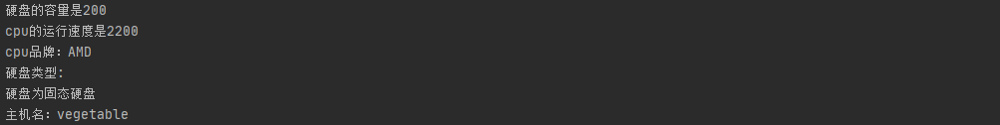

# JAVA第一次实验报告——PC机模拟程序
## 实验目的
---
* 熟悉类中的构造方法的创建。
* 学会运用多种属性的类型。
* 尝试定义属性和方法的修饰符，并且体会他们的具体用法。
* 构建方法的过程中，尽量使方法更加合理（加入合理的逻辑判断）使程序逻辑更加完善。并且避免对类对象属性的直接调用，通过接口（方法）来控制属性。
---
## 实验内容
* 根据面向对象的思想，构建PC类，其下包括CPU，HardDisk等类。整体通过test主类下的main方法实现类的实例化，并调用相关方法。
* 新建包people，其下新建Teacher类，Teacher类下有PC类型的属性。并通过mian方法创建Teacher对象并进行跨包操作。
## 实验方法
  提前阅读课本了解构造方法与属性类型相关知识，快速将基本要求完成。大致阅读书中关于public、private、protect、default的使用范围内容，尝试将修饰符加入程序。在添加的过程中找到错误，代码的编写过程遵循先易后难的原则，在编写完成后在网络上搜索遇到的相关的问题或知识，再次学习。
## 代码设计
  创建名为src的project，其下新建名为people，Homework1的包。前者放置放置Teacher类，后者放置PC，Test，Cpu，HardDisk类，并将Test定义为主类。
  
- 1\. PC类  

    - 1.1 属性
       Cpu cpu
       HardDisk HD
       private String name
    - 1.2 方法
       void setName
       public String getName
       void setCPU
       void setHardDIsk
       void show
## 核心代码
主类中的具体内容
```
        //对象创建
        PC pc = new PC();
        Cpu cpu = new Cpu();
        HardDisk HD = new HardDisk(4000, (float) 2.5,true);
        //方法使用
        cpu.setSpeed(2200);
        HD.setAmount(200);
        pc.setCPU(cpu);
        pc.setHardDIsk(HD);
        pc.show();
        System.out.println("cpu品牌："+cpu.getbrand("AMD"));
        System.out.println("硬盘类型:");
        HD.gettype();
        Teacher ZSB = new Teacher(pc,"男");
        pc.setName("vegetable");
        Teacher.showname();
```
主类同包下的类的定义
```
 Cpu cpu;
    HardDisk HD;
    private String name;
   ···
    void show(){
        System.out.println("硬盘的容量是"+HD.getAmount());
        System.out.println("cpu的运行速度是"+cpu.getSpeed());
        }
```
Teacher跨包定义类的具体实现
```
    //Teacher类定义
    static PC pc;   //使用静态的PC类
    private String sex;       
    
    public Teacher(PC pc,String sex){
        this.pc=pc;
        this.sex=sex;
    }
    String getSex(String sex){
        return sex;
    }
    void setPc(PC pc){
        this.pc=pc;
    }
    public static void showname(){   //public类型静态方法
        System.out.println("主机名："+pc.getName());
    }
```
## 实验结果
实例化cpu，pc，hard disk，并输出cpu速度品牌，硬板的容量以及类型。建立名为ZSB的Teacher对象，定义其性别与主机名并输出主机名。

## 实验感想
